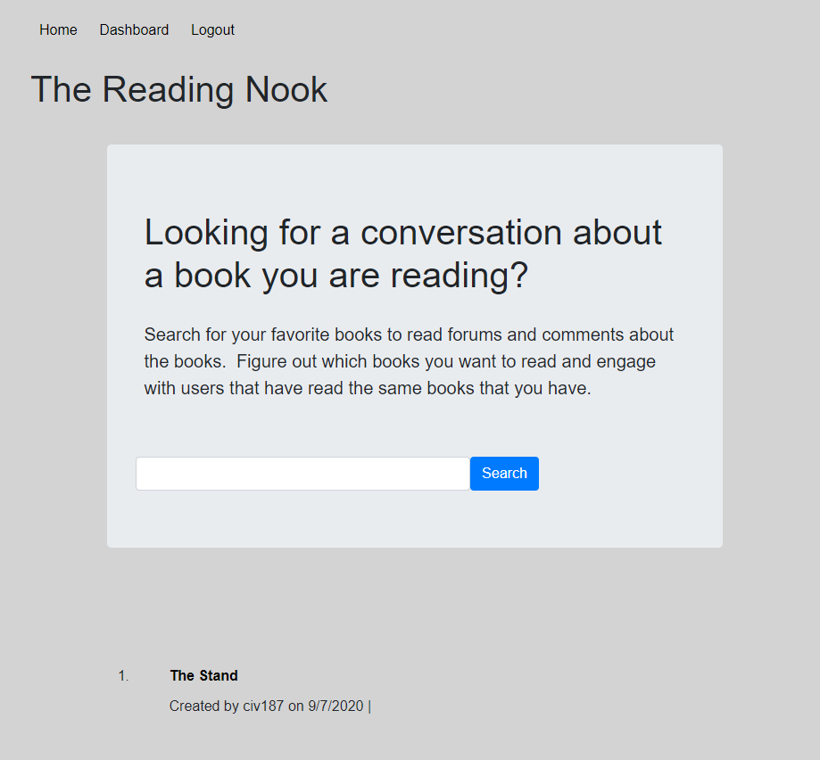

# The Reading Nook (Project 2)

## App URL
https://thereadingnook.herokuapp.com/

## Github URL
https://github.com/asaldana1108/project-2

## Walkthrough Video
https://drive.google.com/file/d/1HwJUveUbCTCdLyOALOHvYLPhStB0AQvi/view

## Description 
This blog style website was designed to give advid readers a place where they can find new books recommendations, review books, and post discussions with a friendly community. 

## Badges

## Table of Contents (Optional)

* [Installation](#installation)
* [Usage](#usage)
* [Credits](#credits)
* [License](#license)

## Installation
npm install

## Usage
npm start

## Contributors
Victor Cesar Lopez, Andrew Van Eman, Joesph Ramos, Jack Hoover, and Alvaro Saldana

## License
MIT
---

## Questions
For any additional questions, here is my contact information. 
### Alvarado Saldana
* [GitHub] (github.com/asaldana1108)
* [Email] (asaldana1108@gmail.com)
### Victor Cesar Lopez
* [GitHub] (github.com/civ187)
* [Email] (civ187@gmail.com)
